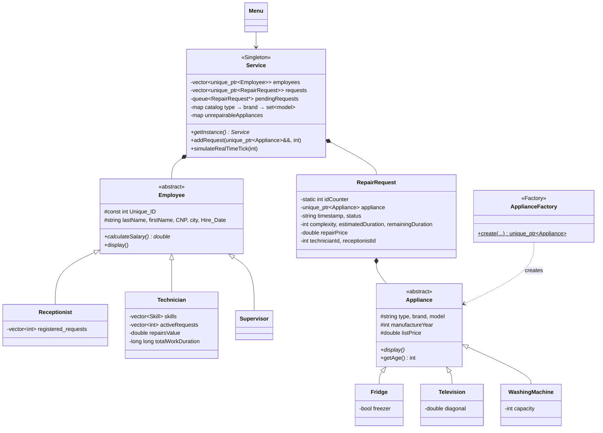
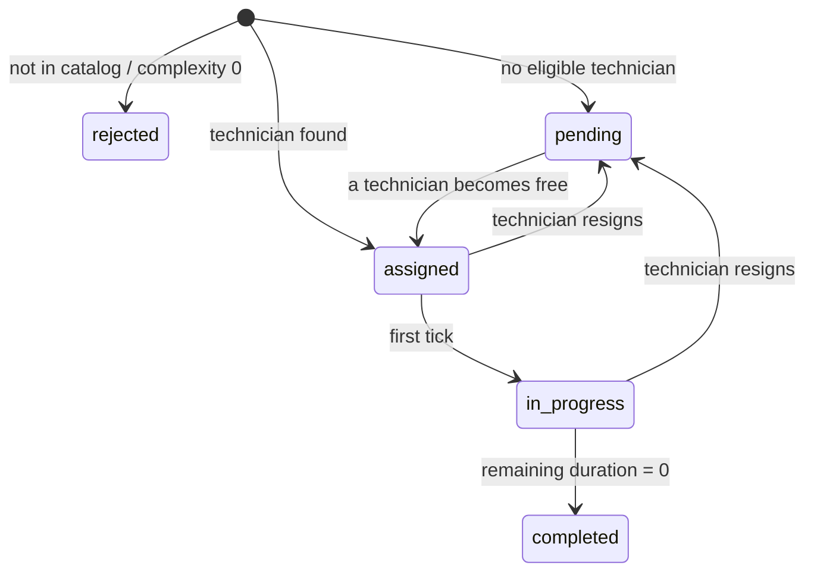

# FixItNow – Technical Documentation

This document describes the architecture of the application, the rules it implements and how the repair simulation works. For build instructions, see the [README](README.md).

## 1. Architecture

### Class diagram



### Classes

| Class | Role |
|---|---|
| `Employee` | Abstract base class with the common data. It validates names, the CNP, the hire date and the minimum age in its constructor and setters. |
| `Receptionist` | Keeps the IDs of the requests it registered. |
| `Technician` | Skills (appliance type + brand), active requests (at most 3), total repair value (for the bonus) and total work duration (for load balancing). |
| `Supervisor` | Has the management bonus. It adds no extra attributes. |
| `Appliance` | Abstract base class: type, brand, model, manufacture year, list price, age. |
| `Fridge` / `Television` / `WashingMachine` | Add their specific attribute: freezer (yes/no), diagonal (cm), capacity (kg). |
| `ApplianceFactory` | Creates the right `Appliance` subclass from its type and validates the input. |
| `RepairRequest` | Owns its appliance, computes the duration and price, and tracks its status. |
| `Service` | Owns the employees, the catalog and the requests. Runs the assignment, the simulation, CSV reading and the reports. |
| `Menu` | Console interface. It reads user input safely and calls `Service`. |
| `Utils` | Dates, CNP validation, number parsing and folder creation. |

### Design patterns

- **Singleton** – `Service::getInstance()` returns a function-local static instance. It is created on first use and destroyed automatically, and copying is disabled.
- **Factory** – `ApplianceFactory::create()` builds a `Fridge`, `Television` or `WashingMachine` from a type string and a map of specific parameters. CSV reading and the menu use the same code path.

### Modern C++ features used

- `unique_ptr` for ownership of employees, requests and appliances. Requests take their appliance with move semantics (`unique_ptr<Appliance>&&`).
- Lambdas for sorting (salaries, unrepairable appliances, the waiting queue).
- Range-based for loops, `auto` and structured bindings (`for (const auto &[type, brands] : catalog)`).
- STL containers chosen per use:
  - `vector` for collections;
  - `queue` for the FIFO waiting list;
  - nested `map`/`set` for the catalog;
  - `map<tuple<…>, int>` for counting unrepairable appliances.
- `<chrono>` for timestamps and the current date.

## 2. Business rules

### Employee validation

| Rule | Implementation |
|---|---|
| Unique ID | Assigned by `Service` and stored as `const`. IDs are never reused, even after an employee leaves. |
| Name | Last and first name of 3–30 characters each. A name change updates both names or neither. |
| CNP | 13 digits. The first digit is 1–8. The birth date must be real (leap years included) and not in the future. The check digit is verified with the key `279146358279`. The CNP must be unique in the service. |
| Hire date | Format `DD-MM-YYYY`. It must be a real date that is not in the future. |
| Minimum age | At least 16 full years at the hire date, computed from the full birth date encoded in the CNP. |

The CNP's first digit gives the century: 1/2 → 1900s, 3/4 → 1800s, 5/6 → 2000s. 7/8 (foreign residents) are treated as 1900s.

### Salary

```
Salary            = 4000 + LoyaltyBonus + TransportAllowance + RoleBonus
LoyaltyBonus      = 5% × 4000 for every 3 full years of service
TransportAllowance= 400 RON if the employee does NOT live in Bucuresti
RoleBonus         = Technician: 2% × value of the repairs they completed
                    Supervisor: 20% × 4000 = 800 RON
```

Years of service are computed from the hire date to the current system date.

### Repair requests

```
Age               = current year − manufacture year   (at least 1)
EstimatedDuration = Age × Complexity                   (time units)
RepairPrice       = ListPrice × EstimatedDuration
```

- Complexity is 1–5. Complexity 0 means the appliance cannot be repaired.
- A request whose type/brand/model is not in the catalog is **rejected**:
  - its complexity is set to 0;
  - the appliance is counted in the list of unrepairable appliances.
- Each request gets a unique `YYYY-MM-DD HH:MM:SS` timestamp. Timestamps have one-second precision, so requests created in the same second (e.g. read from one file) get the following seconds.
- The receptionist with the fewest registered requests registers each new request.

**Request statuses:**



## 3. Assignment and simulation

### Automatic assignment

A request can go to a technician who:

1. has a skill for the appliance's **type and brand**, and
2. has **fewer than 3** active requests.

From these, the technician with the **lowest total work duration** gets the request. The total is the sum of the estimated durations of every request they were ever assigned, so the workload stays balanced over time. If no technician is eligible, the request waits in a FIFO queue.

### A simulation tick

`Service::simulateRealTimeTick(t)` runs one time unit:

1. For each assigned or in-progress request:
   - lower its remaining duration by 1;
   - when it reaches 0, mark the request completed, free the technician's slot and add the repair price to the technician's bonus value.
2. Go through the waiting queue in order and assign every request that now has an eligible technician. Such a request is announced in this tick and starts processing on the next one.
3. Print the IDs still waiting.

Example output:

```
[Time 2] Technician Tech Unu completes the request 2
         Technician Tech Unu is processing the request with id 3 (1 time units remaining)
         Technician Tech Unu completes the request 4
         Technician Tech Unu receives the request with id 5
         Pending requests: 6, 7.
```

When a technician resigns, their unfinished requests go back to the queue, which is kept sorted by request ID (that is, by timestamp).

## 4. Input files

**Employees** – `Type,LastName,FirstName,CNP,City,HireDate,Skills`

```csv
Technician,Ionescu,Maria,2870412123459,Cluj,10-01-2018,Fridge-Samsung;Fridge-LG;Television-LG
```

- `Type` is one of `Receptionist`, `Technician`, `Supervisor`.
- `Skills` is only used for technicians, in the format `Type-Brand;Type-Brand`.

**Requests** – `type,brand,model,manufacture_year,list_price,specific_attribute,complexity`

```csv
Television,LG,OLED55,2021,3500,139.7,2
```

The specific attribute depends on the appliance type:
- **Fridge:** freezer, written as `1`/`0`, `yes`/`no` or `true`/`false`;
- **Television:** diagonal in cm;
- **WashingMachine:** capacity in kg.

Every invalid line is reported with its line number and cause, and reading continues with the next line:

```
Read error: Invalid employee on line 3, cause: The employee must be at least 16 years old at the hire date
Read error: Invalid request on line 2, cause: Manufacture year is not a number: 2020abc
```

## 5. Reports

All reports are CSV files in `reports/`. The folder is created if it is missing.

| Report | Logic |
|---|---|
| `top_3_salaries.csv` | Sorted by salary (descending), then by last + first name. |
| `technician_max_duration.csv` | The technician assigned to the request with the longest estimated duration, with all their data. |
| `pending_requests.csv` | Requests in the waiting queue grouped by type → brand → model, sorted alphabetically, with a count. |
| `employees.csv`, `requests.csv` | Full exports. |

## 6. Known limitations

- The catalog stores only type, brand and model. The manufacture year and list price come from each request.
- The television diagonal is stored in centimeters only.
- Simulation ticks run immediately, without waiting one real second per tick.
- To switch the input files, you edit `main.cpp` and recompile.
